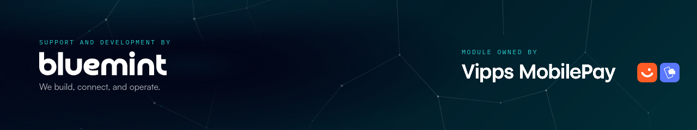

<!-- START_METADATA
---
title: Vipps/MobilePay Login Hyvä Compatibility Module for Adobe Commerce / Magento
sidebar_label: Introduction
sidebar_position: 1
hide_table_of_contents: true
description: Provide Vipps and MobilePay login Hyvä compatibility for your Adobe Commerce website.
pagination_next: plugins-ext/login-magento/docs/documentation
pagination_prev: null
section: Plugins
---
END_METADATA -->

# Login Hyvä Compatibility module for Adobe Commerce / Magento

*This plugin is built and maintained by [bluemint](https://www.bluemint.no/) and is hosted on [GitHub](https://github.com/vippsas/vipps-hyva-magento).
For support, email us at [vipps@bluemint.dev](mailto:vipps@bluemint.dev)*

<!-- START_COMMENT -->
💥 Please use the plugin pages on [https://developer.vippsmobilepay.com](https://developer.vippsmobilepay.com/docs/plugins-ext/login-magento/). 💥
<!-- END_COMMENT -->

Using Vipps/MobilePay is the easiest way to sign in and create an account.

No need to worry about usernames and passwords. All you need to sign in is your phone number.

This module provides Hyvä theme compatibility for the Vipps/MobilePay Login module, so customers can sign in with Vipps or MobilePay on Adobe Commerce websites running Hyvä.

About [Adobe Commerce (*previously called Magento*)](https://experienceleague.adobe.com/en/browse/commerce).

This plugin is available for download at
[https://github.com/vippsas/vipps-login-hyva-magento/releases](https://github.com/vippsas/vipps-login-hyva-magento/releases).

## Support

*Vipps/MobilePay Login Hyvä Compatibility Module for Adobe Commerce* is developed by [bluemint](https://www.bluemint.no/), and the same developers who made
the Vipps/MobilePay Login module also help with improvements, maintenance and developer assistance.

If you are having a problem, please make sure that you are using the latest version:
[https://github.com/vippsas/vipps-login-hyva-magento/releases](https://github.com/vippsas/vipps-login-hyva-magento/releases)

The best way to report a problem (or ask a question) is to use GitHub's built-in "issue" functionality:
[Issues](https://github.com/vippsas/vipps-login-hyva-magento/issues) or email us at [vipps@bluemint.dev](mailto:vipps@bluemint.dev)
